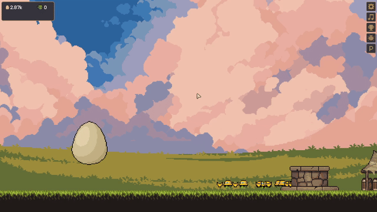

<div align="center">
    <h1>
        Windows OS Scripts Repository
    </h1>
    <p>
        <em> 
            A collection of Windows Scripts, Tips & Tricks useful for automating common & specialized repetitive tasks.
        </em>
    </p>
</div>


<br><br>


## Table of Contents
I. &nbsp;&nbsp;&nbsp;&nbsp;&nbsp;[Script for creating a Virtual Drive from an ISO Image - using PowerShell](#i-script-for-creating-a-virtual-drive-from-an-iso-image---using-powershell) <br>
II. &nbsp;&nbsp;&nbsp;&nbsp;[Script for converting video files to GIFs for GitHub REPOs DEMOs - using PowerShell](#ii-powershell-script-for-converting-video-files-eg-mkv--matroska-video-format-to-a-gif-graphics-interchange-format) <br>
III. &nbsp;&nbsp;&nbsp;[AutoClicker - using AutoHotkey](#iii-autoclicker---using-autohotkey)


<br><br>


## I. Script for creating a Virtual Drive from an ISO Image - using PowerShell
*(Mounting and Dismounting an ISO Image)*

<br>

### Purpose: Creating a Virtual Drive from an ISO Image

<br>

### Utility/solved issue: 
- You receive physical copies (CDs/DVDs), from the hospital, containing X-Ray (Radiography) software and imagery
- One of the devices (PC/laptop) that you/your doctor need(s) to use does not have an ODD (optical disc drive)
- You or the doctor need to check the imagery
- ***The imagery software only works while in a non-rewrittable environment***

<br>

### Instructions:
1. Request from the hospital a copy of the files / gain access to a device that has an optical disc drive, insert the CD/DVD and copy the entire content to a new folder, on a USB stick *(for example)*
2. Use a free software like PowerISO *(https://www.poweriso.com/download.htm)* in order to create an ISO image from the new folder utilized in the previous step (ISO filename: "rad")
3. Download the script from here [Mount_ISO.ps1](https://raw.githubusercontent.com/RomulusMirauta/Windows-Scripts/main/POWERSHELL%2B/PowerShell_MountDismount_DiskImageISO/Mount_ISO.ps1) *(right-click and choose "Save link as...")*
4. Copy/move the script to the same directory that contains the created ISO image
5. Execute the script by right-clicking on it and choosing "Run with PowerShell"
6. Open Windows Explorer and go to This PC - alongside the Local Disk(s), a virtual drive will be shown
7. Double-click on it and review the imagery

<br>

### Workarounds:

> [!IMPORTANT]
> Workaround ***for step 5*** - if the script is not executing - follow these steps:
> - right-click on it and choose Properties
> - at the bottom, check the Unblock box
> - click Apply and then OK
> - attempt to execute the script again, by right-clicking on it and choosing "Run with PowerShell"

<br>

> [!NOTE]
> If the aforementioned workaround did not solve the issue, you might need to change the Execution Policy for PowerShell, using this command:
> ```ps1
> Set-ExecutionPolicy RemoteSigned -Scope CurrentUser
> ```
> - Sets the Execution Policy to Remotely Signed *(allows to run any scripts created locally, without a digital signature)* for Current Windows User *(currently logged-in user)* <br>
> - Error, e.g. "npm : File C:\Program Files\nodejs\npm.ps1 cannot be loaded because running scripts is disabled on this system. For more information, see..."


<br>

> [!IMPORTANT]
> Workaround ***for step 7*** - if a folder is shown - follow these steps:
> - double-click on the folder
> - locate an executable file (.exe file extension), like "DicomViewer.exe"
> - double-click on it and review the imagery

<br>

### Instructions - only for dismounting:
1. Open Windows Explorer and go to This PC - alongside the Local Disk(s), a virtual drive will be shown
2. Right-click on it and choose Eject


<br><br><br>


## II. PowerShell script for converting video files (e.g. MKV = Matroska Video format) to a GIF (Graphics Interchange Format)

<br>

### Links
- https://obsproject.com/
- https://github.com/FFmpeg/FFmpeg

<br>

### Steps to follow:
1. Record the video - I recommend:
   - Software = [OBS](https://obsproject.com/)
   - Recording format (output) = Matroska Video (.mkv)
   - Muting / not recording audio *(not needed)*
2. Download the script: [ffmpegScriptConversionVideoToGif_v1.4.ps1](https://raw.githubusercontent.com/RomulusMirauta/Windows-Scripts/main/POWERSHELL%2B/ffmpeg/ffmpegScriptConversionVideoToGif_v1.4.ps1)
   - Right-click and choose "Save link as..."
   - ***OR***
   - Click on link and press key combination `CTRL + SHIFT + S`
3. Move/copy the script to OBS output folder *(default = "C:\Users\<username>\Videos\OBS")*
4. Create a new folder and copy/move the recorded video file to it
6. Run the script
   - From Windows/File Explorer - right-click and choose "Run with PowerShell"
   - From PowerShell CLI
       - `cd` to script's location
       - ```ps1
         powershell -ExecutionPolicy Bypass -File .\ffmpegScriptConversionVideoToGif_v1.4.ps1
         ```
7. Follow the instructions shown in the PowerShell window

<br>

> [!IMPORTANT]
> If you're having issues running the script, please try this [***workaround***](#workarounds).

<br>

> [!NOTE]
> - This workflow is useful for creating DEMOs for GitHub REPOs.
>     - GitHub can display several common image formats, including PNG, JPG, **GIF**, PSD, and SVG
>     - The **MKV** *(.mkv)* file format is not officially supported as an interactive or playable format on GitHub.
> - MKV = Matroska Video = a free, open-source multimedia container format that bundles video, audio, subtitle, and image tracks into a single file
> - GIF = Graphics Interchange Format = a digital image file format supporting both static pictures and short, looping, silent animations, widely used on the internet for reactions and short clips
> - The resulting GIF file might be bigger than the video file used as input.
> - Other video file formats that are supported as input by ffmpeg: MP4, WebM, MOV, AVI, WMV, FLV, MPEG/MPG, M4V, 3GP, TS/M2TS, OGV, VOB.

<br>

### Script updates/features list:
- **v1.0** - Initial release, features only MKV to GIF conversion <br>
- **v1.1** - Switched from BATCH to PowerShell because of limitations; features: ffmpeg presence or auto-installation, as well as more descriptive messages for the end-user <br>
- **v1.2** - Features conversion from any video file format supported by ffmpeg to GIF format, removed necessity of script re-run after ffmpeg installation <br>
- **v1.3** - Removed requirement that input file be named "input", removed annoying final user input after successful file conversion <br>
- **v1.4** - Features user input for selecting between different scaling options *(output file resolution)* <br>

<br>

> [!NOTE]
> - `scale=1920` - only sets the output width to 1920 pixels.
> - The height will be computed automatically to whatever keeps the original aspect ratio (because of parameter `-1`). 
> - Output file resolution will be 1920×1080 **only** if the source file resolution is 16:9.


<br><br><br>


## III. AutoClicker - using AutoHotkey

<br>

### Source files
- [AHK/AutoClicker.ahk](AHK/AutoClicker.ahk)
- [AHK/AutoClicker-Compatibility.ahk](AHK/AutoClicker-Compatibility.ahk)

<br>

### Executables
- [AHK/AutoClicker.exe](AHK/AutoClicker.exe)
- [AHK/AutoClicker-Compatibility.exe](AHK/AutoClicker-Compatibility.exe)

<br>

### Hotkeys
- F1 = Start clicking
- F2 = Pause/Reload script
- F4 = Exit script

<br>

> [!NOTE]
> - **AutoClicker.ahk** uses a fast, single-click loop.
> - **AutoClicker-Compatibility.ahk** uses explicit mouse up/down with a small delay for compatibility.

<br>

### Demo video
- [Game: The Great Hatch](https://store.steampowered.com/app/3745230/The_Great_Hatch/)
- [DEMOs/AutoClicker.gif](DEMOs/AutoClicker.gif)

<br>




